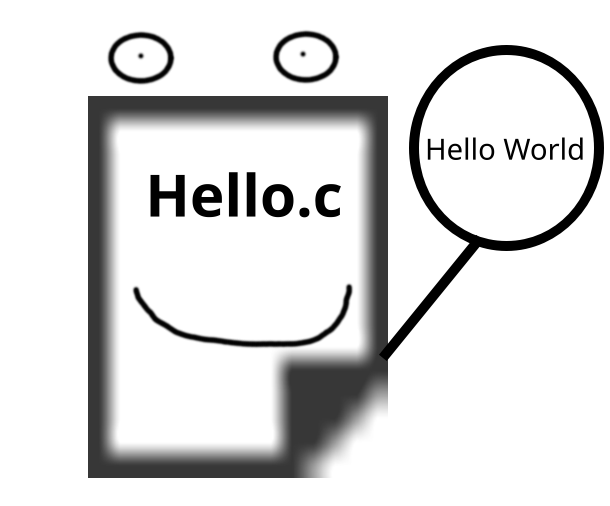
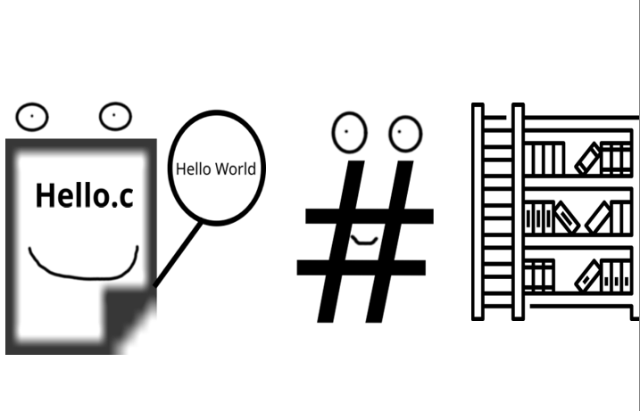
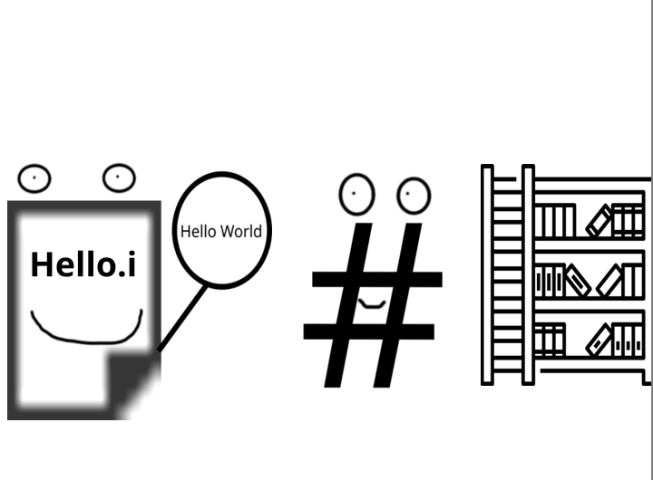
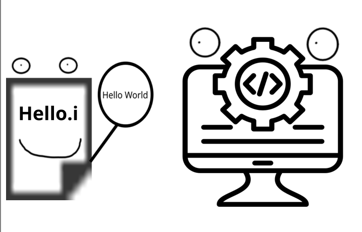
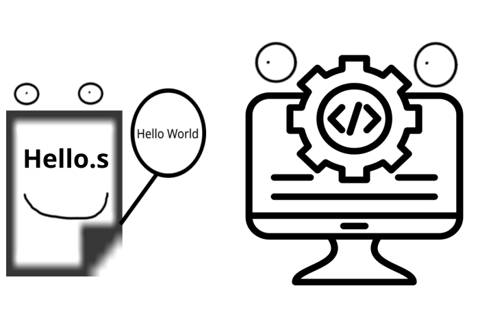
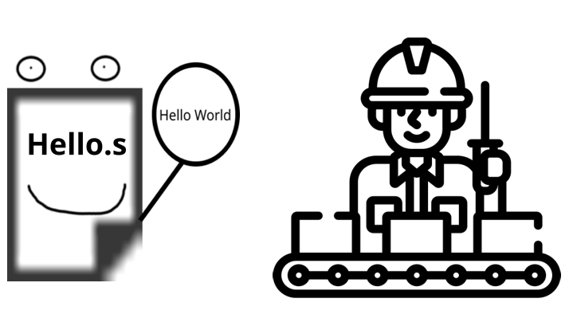
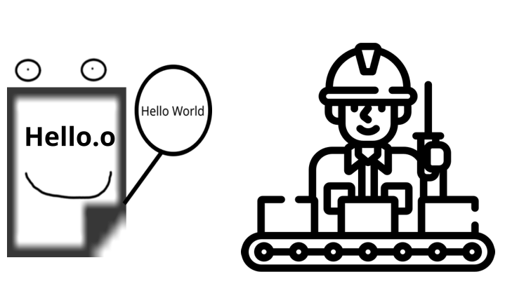
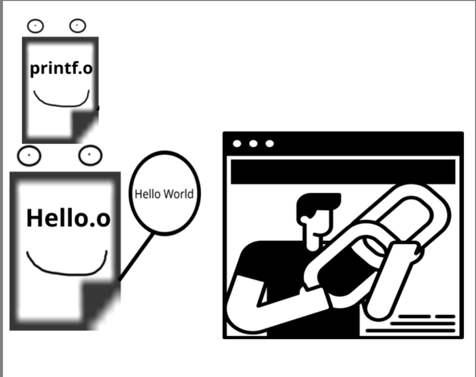
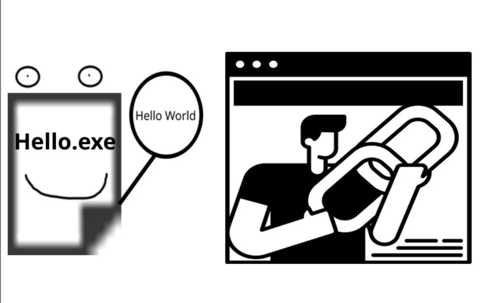

Once upon a time, in the magical world of coding, there was a young file named hello.c. One sunny morning, it set out on an exciting adventure inside the computer. But this journey was not just a regular walk; it was a quest to become a working program.

## Meeting the Preprocessor

As it traveled, hello.c first encountered a knowledgeable character named Preprocessor. adorned with a library symbol, Preprocessor greeted hello.c with enthusiasm:

**Preprocessor:** “Hello there! I’m the Preprocessor. I’m here to read and understand your code. I will get everything ready for the next step!”

The Preprocessor carefully examined the code, cleaning up unnecessary parts and preparing it for the journey ahead. It added important libraries, making hello.c even stronger.

**Preprocessor:** “I’ve added necessary libraries like #include <stdio.h>. Now you’re ready to move on to the next step, which is the Compiler! You’ll become hello.i now!”

## The Compiler and the Compilation Process

After finishing with the Preprocessor, hello.i met the skilled Compiler. Shaped like a computer screen displaying lines of code, the Compiler said excitedly:

**Compiler:** “Welcome, hello.i! I’m the Compiler, and my job is to compile your code into assembly language. Let’s get started!”

The Compiler processed the code step by step, checking for syntax errors and ensuring it followed the rules of the language. It created an assembly file named hello.s.

**Compiler:** “Now we have your assembly file, hello.s! But it can't stand alone; we need to send it to the Assembler.”

## Assembler and the Transformation

Hello.s continued its journey and soon met the knowledgeable Assembler. Dressed in assembly gloves, the Assembler welcomed hello.s warmly:

**Assembler:** “Hello, hello.s! I’m the Assembler, and I’m here to convert you into machine code!”

The Assembler took the assembly file, hello.s, and transformed it into machine code, creating an object file called hello.o.

**Assembler:** “You now have an object file, hello.o. But our work isn’t done yet! We need to send it to the Linker.”

## The Linker and the Final Assembly

Finally, hello.o met the helpful Linker, a friendly figure holding various connection tools in his hands. With a warm smile, he gestured to the many small parts surrounding him and said:

**Linker:** “Welcome, hello.o! I’m the Linker, and my job is to combine all the code pieces together!”

The Linker took the object file, hello.o, and merged it with the necessary components. It ensured everything worked together perfectly.

**Linker:** “Now all the pieces are connected! I’ve combined all the necessary libraries and files to create a working program. It’s time to present you as hello.exe!”

## Becoming hello.exe

After a long journey, hello.c was finally reborn as hello.exe. Once just a file, it had transformed into a working program.

**Hello.exe:** “Hello, World!” it exclaimed as it began its life, ready to shine on users' computers and deliver its message.

This journey tells the story of hello.c’s transformation into hello.exe. Each character played a crucial role in this process. Preprocessor, Compiler, Assembler, and Linker all contributed their expertise, successfully turning the code into a working program.
